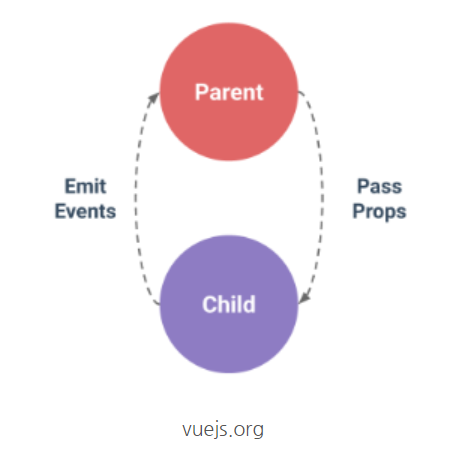

# chrome
1. 뷰 개발자 도구[vue.js.devtools](https://chrome.google.com/webstore/detail/vuejs-devtools/nhdogjmejiglipccpnnnanhbledajbpd)


# VS Code 

## plugin
1. Vetur
2. material Icon Theme - file > preference.. > File Icon Theme
3. Night Owl - file > preference.. > color theme
4. Live Server
5. ESLint
6. Prettier
7. Auto Close Tag
8. Atom Keymap

## 단축기 
1. ! + tab 
2. div#id + tab
3. vue + tab(vue 파일 에서) - vue 템플릿을 만들수 있다. 

## 도옴 될만한 ..
1. https://jsonplaceholder.typicode.com/ //request를 날려볼 수 있는 ..


# Vue

```
공식 튜토리얼 
https://vuejs.org/v2/guide/routing.html
https://vuejs.org/v2/guide/forms.html#Text

```

1. MVVM 패턴의 뷰모델 레이어에 해당하는 화면단 라이브러리
    - DOM Listeners: View 의 변경 감지 
    - Data Bindings: Modle(Java Script Object) 를 받아서 View 에 뿌려 주는 역할 

2. 인스턴스 new Vue({});
3. component View 영역분할, 관계 
    - 전역: Vue.component('tag name', {}), 모든 인스턴스에 등록 된다. 
    - 지역: 인스턴스 별로 생성 해야 겠지?  
        ```javascript
        components:{
            'app-footer':{
                template: '<footer>footer</footer>'
            }
        }
        ```

4. instance 는 Root 가 된다 Component 는 하위로 
5. Component 통신
   - 하행은 Props 전달
   - 상행은 Event Emit

    

    - props 문법 v-bind: 인스턴스.컴포넌트.타겟태그.props = 인스턴스.data 의 Key
    - props 는 자식에 선언하고, 부모에서는 자식의 props Value 를 사용하여 v-bind를 통해 원하는 데이터를 자식에게 전달 
        ```javascript
        <div id="app">
            <app-header v-bind:propsdata = "message"></app-header>
        </div>
        <script src="https://cdn.jsdelivr.net/npm/vue/dist/vue.js"></script>
        <script>

            var appHeader = {
                template: '<h1>{{ propsdata }}</h1>',
                props: ['propsdata']
            }
            new Vue({
                el: '#app',
                components:{
                    'app-header': appHeader
                },                
                data: {
                    message: 'hi'
                }
            })
        </script>
        ```

    - event 문법 v-on native dom event 를 listening 한다. 
      - https://developer.mozilla.org/en-US/docs/Web/Events
      - https://developer.mozilla.org/ko/docs/Web/Events
      - keyup.enter <- enter를 칠때 만 이벤트 발생 
    - tag 의 경우 v-on:하위컴포넌트 에서 발생한 이벤트이름="상위 컴포넌트 메서드이름"
        ```javascript
        <div id="app">
            <app-header v-on:pass="logText"></app-header>
        </div>
        <script src="https://cdn.jsdelivr.net/npm/vue/dist/vue.js"></script>
        <script>

            var appHeader = {
                template: '<button v-on:click="passEvent">Click Me</button>',
                methods:{
                    passEvent: function() {
                        this.$emit('pass');
                    }
                }
            }
    
            new Vue({
                el: '#app',
                components: {
                    'app-header': appHeader,
                },
                methods: {
                    logText: function() {
                        console.log('hi')
                    }
                }
            })
        </script>

        ```
    - 같은 레벨에서 통신 
      - 주려는 쪽에선 Event 로 올리고 받으려는 쪽에서는 props 로 내린다. 
      - ```$emit('pass', 10)``` 을 할 경우 Vue 인스턴스의 Methods 프로퍼티의 함수에서 인자 10 을 받을 수 있다. 
6. Vue 라우터 
    - 싱글 페이지 앱을 쉽게 만들어 준다. 페이지 이동 관련 기능을 담당한다. 
    - router-view tag 에 컴포넌트가 나온다. 
    ```javascript
    var router = new VueRouter({
    // 페이지의 라우팅 정보 
    routes: [
        {
            // 페이지 URL 이름
            path: '/login',
            // 해당 URL 에서 표시될 컴포넌트 
            component: LoginComponent
        },
        {
            path: '/main',
            component: MainComponent
        }
    ]
    });
    ```
    - router-link 화면에서 링크를 연결해주는 기능 ```<a href="">``` 와 비슷한 기능 
      - ```<router-link to="/main">Main</router-link>```
    - router 의 compoenent 는 하나이다. 

7. axios 
    - Vue 공식 HTTP 라이브러리 예전에는 Vue Resource 였다. 
8. Vue 탬플릿 문법 
    - {{ message }} vue 인스턴스 data.message 를 출력 
    - dom을 reactive 하게 조작할 수 있다. 
      - ```html<p v-bind:id="uuid">{{ num }}</p>``` => ```html<p id="abc1234">10</p>```
    - v-show dom 은 남겨 놓고 display option 만 display 안하게 한다. 
9. watch 와 computed
    - watch
      - data의 값의 변화를 추적할 수 있다. 뭔가 무거운 작업 데이터를 받아서 요청하는 경우 
    - computed
      - 인스턴스 안의 데이터를 가지고 연산 작업을 할 수 있다. Validation 값을 측정할때 간단하 테스트 연산, 튜닝이 잘되어 있음으로 빠르다.

10. Vue cli
    - 3.x 
    - vue create '프로젝트 폴더 위치'
    - npm run serve
    - vue file 
      - template, script, style 로 구성된다. a.vue 참조 
      - template 안에는 하나의 root 엘리먼트만 위치 시킬 수 있다. 
      - script 에서는 data 프로퍼티에 Object 를 바로 쓸수 없고 함수 형식으로 선언해서 써야 한다. 


## 참조 
- 인프런 
  - Vue.js 시작하기 